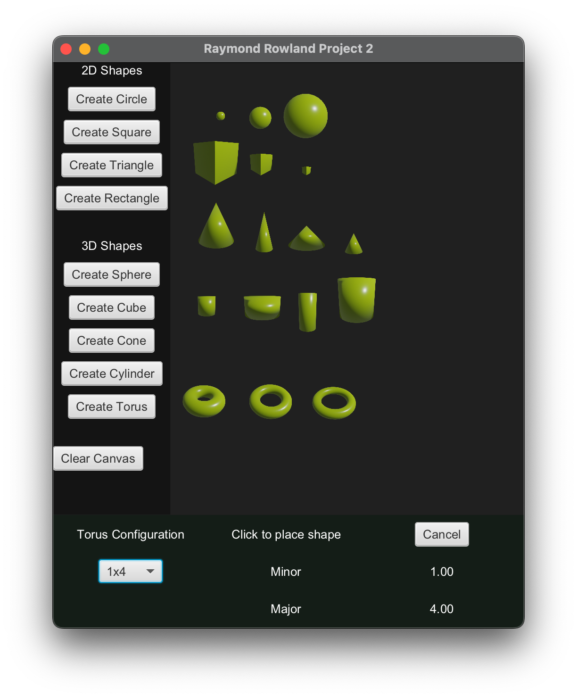

# Project 2 Java Shapes GUI

- [Project Requirements](#project_requirements)
- [Installation](#installation)
- [Usage](#usage)
- [Troubleshooting](#troubleshooting)

## Project Requirements

Design, implement and test a set of Java classes that allows a user to select a shape from a list of available shape images, enter appropriate dimensional parameters (suggest a dropdown box of dimensional size choices) and then display that shape in a frame (either as an image or as a drawing).

    
Show Project Requirements

- [x] Give the user to select a shape
- [x] Allow the user to configure the shape
    - [x] Sliders for 2d generated shapes
    - [x] Combobox to load selected images for 3d shapes
- [x] Allow user to draw shapes in main menu until the shape menu is closes
- [x] Error checks should be in developed to make sure appropriate menu items and types of data were input. 
- [x] Box user data entry

- [x] Designs a Java class Inheritance hierarchy that would satisfy the following is- a and has-a relationships:
    - [x] A Shape is an object
    - [x] A Shape has a NumberofDimensions
    - [x] A TwoDimensionalShape is a Shape
    - [x] A TwoDimensionalShape has an area
    - [x] A Circle is a TwoDimensionalShape
    - [x] A Square is a TwoDimensionalShape
    - [x] A Triangle is a TwoDimensionalShape
    - [x] A Rectangle is a TwoDimensionalShape

    - [x] A ThreeDimensionalShape is a Shape
    - [x] A ThreeDimensionalShape has a volume
    - [x] A Sphere is a ThreeDimensionalShape
    - [x] A Cube is a ThreeDimensionalShape
    - [x] A Cone is a ThreeDimensionalShape
    - [x] A Cylinder is a ThreeDimensionalShape
    - [x] A Torus is a ThreeDimensionalShape

## Installation

To build the project press the play button for your IDE’s Java build and run pipeline. 

### Tests 
Run the tests in VSCode test explorer or equivilent test suite.

## Usage
Perfered method is to use a IDE's build and run tools. Open the project and once your Java environment is in a ready state open the Project1.java file and press the run button for the IDE.

Once open you will see the main menu above. There are three sections to this UI: the drawing pane, the shape selection, and the shape configuration.  

You will select a shape from the left pane and the bottom section will switch to a configuration menu for that shape type. Configure the options for the selected shape and click in the drawing pane to place that shape. Click the cancel button to close the configuration pane. 

### 2D Shapes

### 3D Shapes

## Troubleshooting
If your project stops building and running with the Java plugins you may have a Java cache issue. In VSCode on a failed build there will be an option to clear the cache.  This has fixed the buiid pipeline issues for me in the past.
