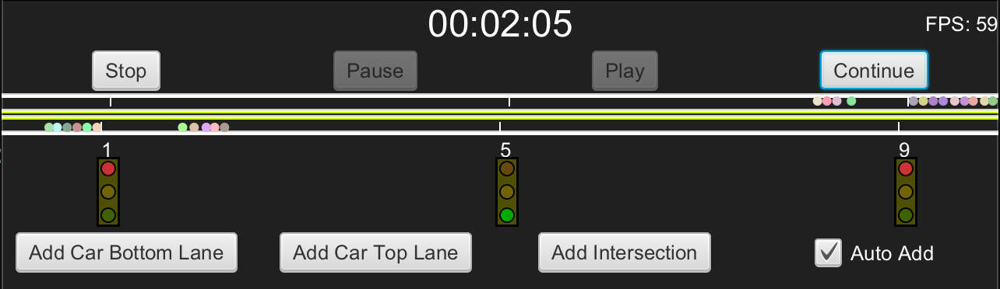
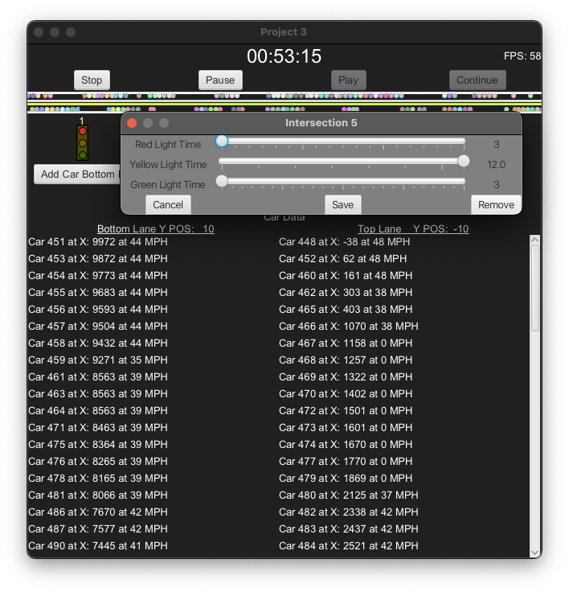
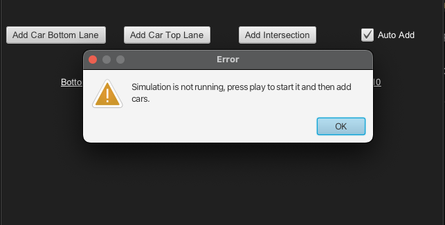
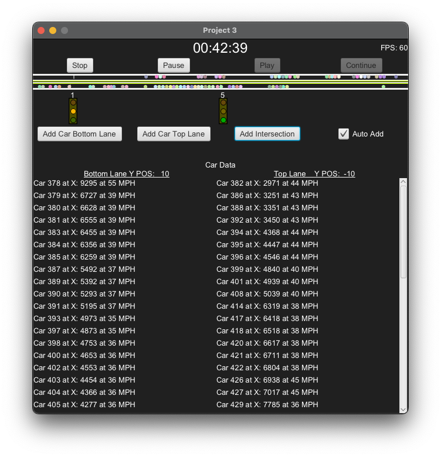

# CMSC 335

## User Guide
Download the zipped folder and extract the code to a user accessible folder (i.e. c:\Users\<UserName>\Desktop). This guide was developed using VSCode as the IDE. I will focus on use from within that IDE, but all methods can be implemented in other tools. Once the code is extracted, open the folder in VSCode.  

Once opened, install the Extension Pack for Java (v0.29.0) extension. The environment utilized to create and test this project is below. 

- Mac macOS 12.7.6  
- Java Open-JDK : 21.0.6 

## Simulation Design 
I chose to create this simulation using only a few threads. The main thread, the UI thread, a time keeping thread, and a physics thread. The time and physics threads operate using the observer pattern. The timekeeper thread sends out notifications on the second. The physics thread operates on 16ms intervals, giving a physics update of roughly 60 frames per second. Each physics listener is notified every tick and they will perform their physics calculations, collision checks, and intersection polling then send their UI updates to the UI thread for processing. The road in my simulation covers 10,000 meters (6.22 miles), possibly giving the appearance the cars are slow.  

Cars can be added to a lane heading left to right (bottom) or right to left (top). Cars will get a random speed assigned at instantiation between 35 and 55 MPH. They will look ahead in their lane to locate the next vehicle and poll it per physics calculation to determine if they need to slow down to avoid collision. Cars will also poll the next intersection to determine if the light is red. I added the ability to allow the application to add cars on a random interval in a random direction. This can be toggled by a checkbox in the UI. 

Lights are physics objects as well.  They required a fine-tuned constant time that was not aligned with seconds. Using physics delta time to calculate time since last light change, the lights are able to operate on any time scale. Light timings can be adjusted by double clicking and editing the timings. A light can be removed by right clicking on it or in the setting menu by clicking the remove button. Lights will be added with a pattern that tries to half a section. The pattern is 5, 1, 9, 3, 7, 4, 6, 2, 8 with these numbers aligning to thr lights in the image. If a light is removed and a new one added, the new light will be added to the first available slot in the pattern above. 

## Assumptions 

The road is not to scale. Lane width is magnitudes larger to allow for the huge cars that allow users to see the simulation. The length of the road is 10,000 meters and the road is 640 pixels, making one pixel roughly 16 meters. This means a car moving at 35 miles per hour will travel ~0.261 meters per frame, at times it may appear cars are not moving at low speeds they may need several frames to move one pixel. 
Cars are not to scale, the scale is so users can see them, they would be almost 100 meters long at this scale 
Cars maintain a 100-meter distance, unrealistic but this prevents them from appearing to occupy the same space at the same time 
Cars can start and stop without G forces or Earth based physics applied 

## Usage 

Launch the application in your editor. Once the application is running the simulation will be in a stopped state. Press the play button to start the simulation. By default, the simulation will add cars automatically. You can press the add car to “X” lane button to add cars to the road manually. You can disable the auto add feature by clicking the Auto Add checkbox.

You can add up to 9 intersections to the simulation with the add intersection button. To remove an intersection, right click it or you can also remove it using the settings menu. If you wish to edit an intersection's light timing, double click on the light. 

### Add car and intersection UI components

### UI component for setting intersection settings

### Blocking the user from adding or deleting objects while the simulation is not running

### Image of the simulation running for a long time with hundreds of cars and intersection have been added and remooved

